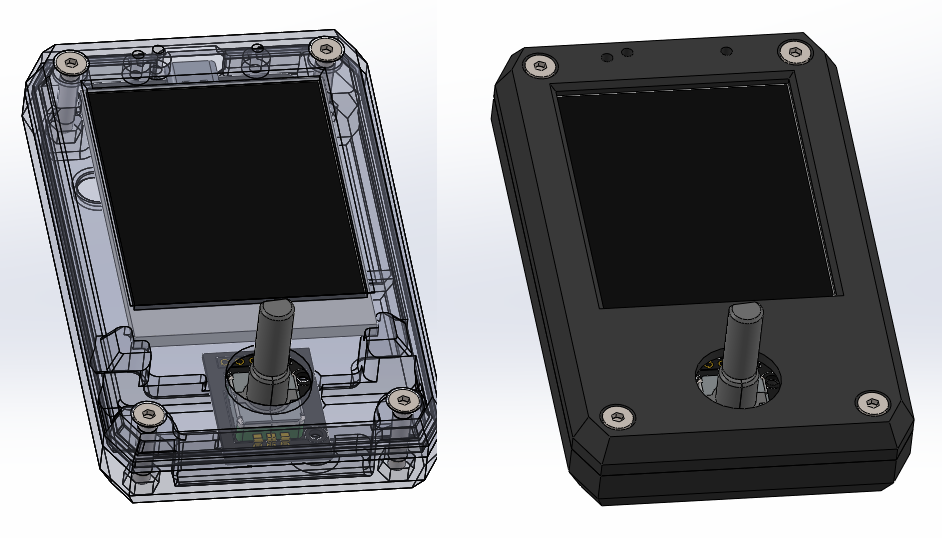
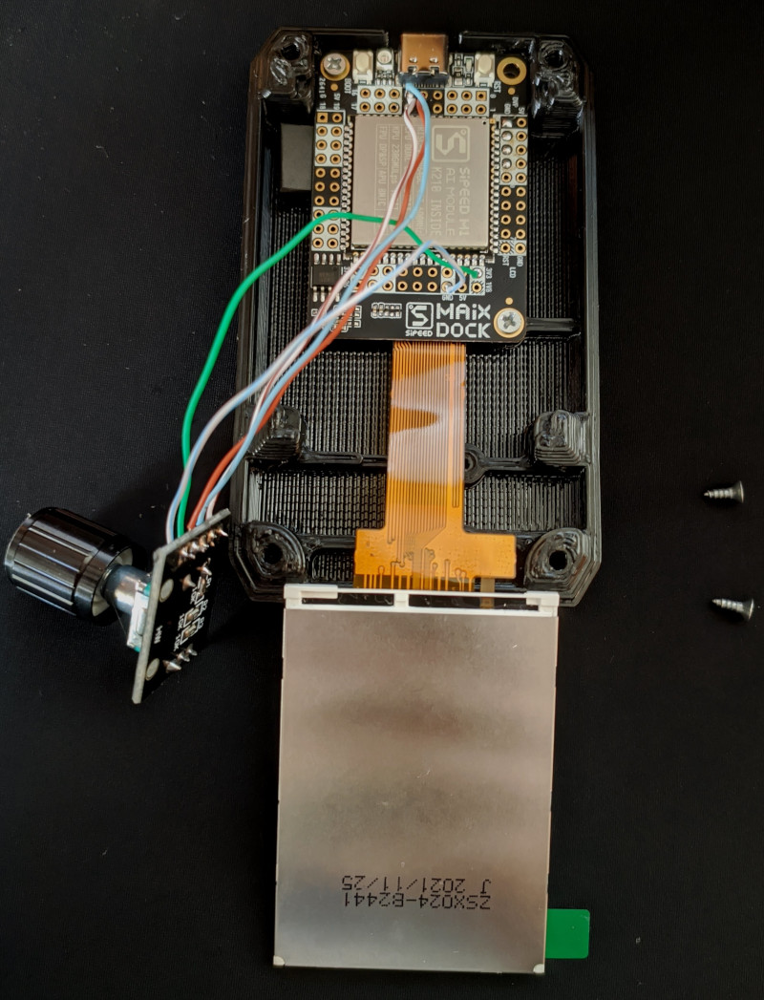
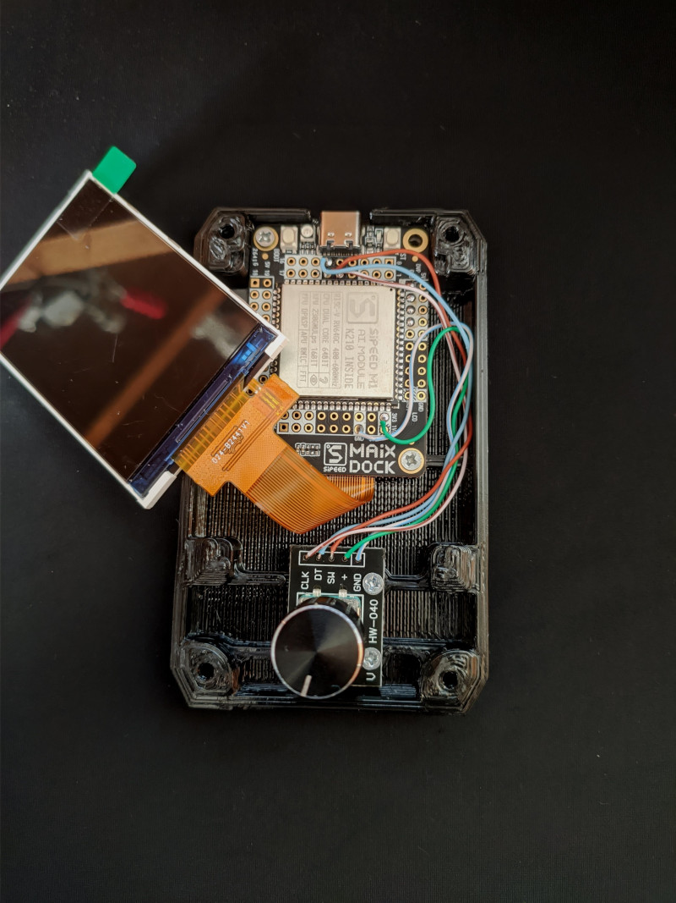
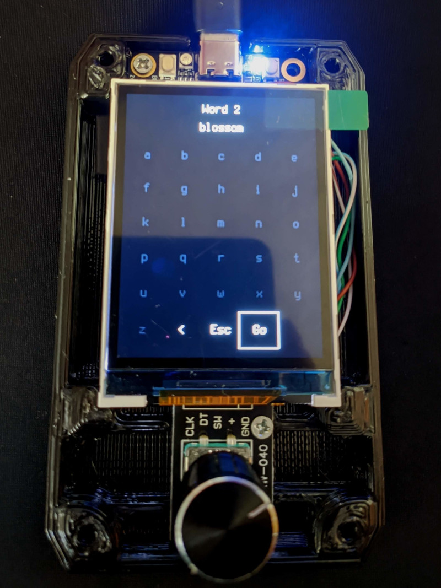

# Maix Dock Enclosure for Krux Signer
Case for Maix Dock board with camera, display and a rotary encoder, intended to be used with Krux Signer



Materials for building a Krux 
- Printed parts
- Maix Dock with display and camera
- Rotary Encoder Ky-040
- 4 Screws for plastics (~2.5 mm) x 4mm 
- 4 M3 nuts
- 4 M3 x 16mm Allen flat screws
- 5 ~8cm thin wires
- 1cm x 1cm x 1mm thieck adesive foam

Instructions

Print the stl files, clean and test fittings.

Solder wires between board and rotary encoder.

```
Encoder - Maix Dock
   GND <->  GND
     + <->  3V3
    SW <-> Pin 9
    DT <-> Pin 10
   CLK <-> Pin 11
```

Use the foam as a flexible spacer between camera and board. It will keep the camera slightly pressed against the enclosure. Carefully place the board, with camera on place and use 2 plastic screws in diagonal to fix the board and camera to the back enclosure.



Put wires in place and use the other 2 plastic screws to mount the encoder.



Put the display in place



Put the front enclosure in place and fix it with M3 screws and Nuts

